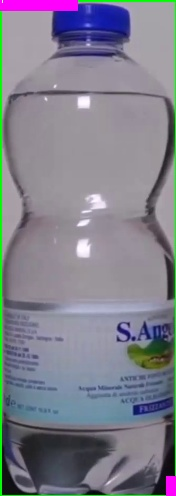
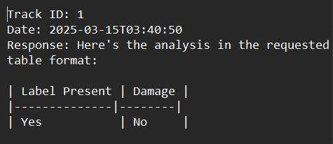

# Smart-Bottle-Inspection-System


## Introduction

The **Smart Bottle Inspection System** is an AI-powered solution for real-time bottle inspection using **YOLO** for object detection and OpenAI's **GPT-based API** for image analysis. This system processes video streams to detect and evaluate bottle labels, ensuring product quality in industrial settings.

## Features

- **Real-time bottle detection** using YOLO.
- **Automated label inspection** using OpenAI models.
- **Frame-by-frame object tracking** with unique IDs.
- **Cropped image saving** for defective products.
- **Parallel processing with threading** for improved performance.
- **Detailed analysis reports** stored in text files.

## Installation

### Prerequisites
- Python 3.8+
- OpenCV
- NumPy
- cvzone
- Ultralytics YOLO
- OpenAI Python SDK

## Usage

1. The system processes a video stream (`test.mp4`) for detecting bottles.
2. When a bottle enters the detection zone, it is analyzed for label presence and damage.
3. Results are stored in structured text files.
4. Press `q` to quit the application.

### Example Output

```txt
Track ID: 5
Date: 2024-03-18 10:45:32
Response:
| Label Present | Damage |
|--------------|--------|
| Yes          | No     |
```

## Screenshots




## Technologies

- **YOLO** for object detection
- **OpenCV** for video processing
- **NumPy** for numerical computations
- **OpenAI API** for AI-driven analysis
- **cvzone** for easy visualization

## Contact

- **Author**: Ammar Mohamed Amin
- **Email**: ammarmohamedamin0@gmail.com
- **GitHub**: [Your GitHub Profile](https://github.com/AmmarMohamed0)

## Acknowledgments

- **Ultralytics** for the YOLO framework.
- **OpenAI** for the image analysis API.
- **OpenCV and NumPy** for efficient image processing.

---

Enjoy using **Smart-Bottle-Inspection-System**! 🚀

